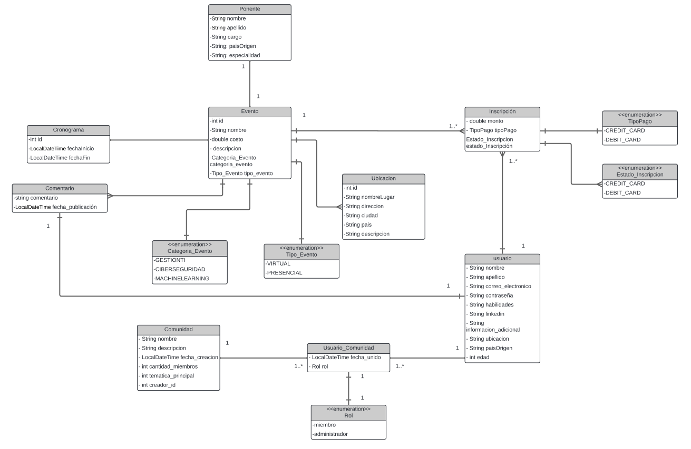
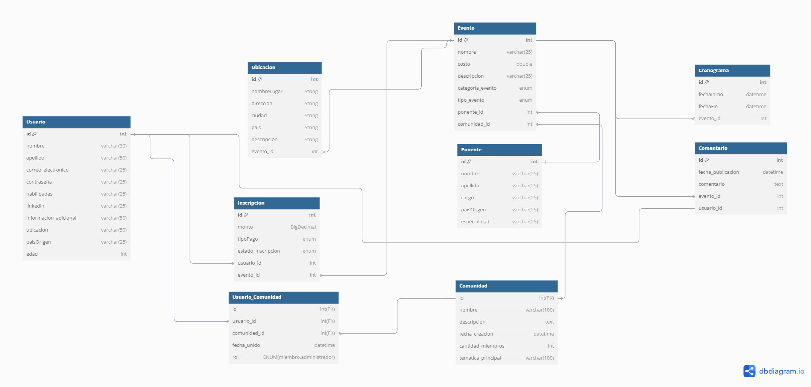

## Introducción

**Tech Comunity** tiene como objetivo desarrollar una aplicación web que facilite la organización y participación en eventos tecnológicos y de networking. 
La plataforma permite a los usuarios crear, buscar y unirse a eventos relacionados con sus intereses tecnológicos, así como conectarse con otros profesionales y compartir conocimientos.
El proyecto está diseñado para promover el aprendizaje colaborativo y fomentar la creación de comunidades tecnológicas. Se enfoca en estudiantes y profesionales del sector tecnológico, brindando una herramienta que facilita la interacción y el crecimiento en un entorno digital.

### Colaboradores del Proyecto

| **Nombre**                | **Rol**              | **Perfil**                                                                       |    **Imagen**     |
|---------------------------|----------------------|----------------------------------------------------------------------------------|-------------------|
| Diego Sanchez Chuquimango | Líder del Proyecto   | [LinkedIn](https://www.linkedin.com/in/dsanchezchu/)                             || 
| Leonardo Sanchez Romero   | Miembro del Proyecto | [LinkedIn](https://www.linkedin.com/in/leonardo-sanchez-607883218/)              ||
| Charlie Morales Benites   | Miembro del Proyecto | [LinkedIn](https://www.linkedin.com/in/charlie-morales-benites-69553b2a6/)       ||
| Rumay Yglesias Eduardo    | Miembro del Proyecto | [LinkedIn](https://www.linkedin.com/in/eduardo-daniel-rumay-yglesias-97b106329/) ||

### Progreso del Proyecto Tech Comunity Peru

| **Columna**       | **Descripción**                                                                                                                                    |
|-------------------|----------------------------------------------------------------------------------------------------------------------------------------------------|
| **Backlog**       | Contiene todas las historias de usuario, tareas y características que deben desarrollarse. Es el listado de todo el trabajo pendiente.              |
| **En Progreso**   | Incluye las tareas que están actualmente en desarrollo. Visualiza el trabajo en curso para asegurar el flujo continuo de trabajo.                   |
| **Revisión**      | Después de completar una tarea, se mueve aquí para una revisión de código y revisión por pares (peer review). Esta fase incluye la creación de **pull requests** para asegurar que el código cumpla con los estándares de calidad antes de integrarse al proyecto principal. |
| **En Pruebas**    | Contiene las tareas que han pasado la revisión de código y necesitan pruebas exhaustivas (unitarias, de integración y de aceptación) para garantizar su calidad. |
| **Hecho**         | Las tareas completamente desarrolladas, revisadas y probadas se mueven aquí, indicando que están listas y finalizadas.                               |

Mira cómo va avanzando nuestro trabajo visitando el siguiente enlace: [Tablero de Github](https://github.com/orgs/Tech-Community-Peru/projects/4).

### Funcionalidades de la Aplicación BookHub

## Módulos Principales

### 1. Módulo de Gestión de Usuarios:
- **Registro y Perfiles de Usuarios**: Los usuarios podrán registrarse y crear perfiles detallados, incluyendo sus intereses tecnológicos, habilidades, y enlaces a sus redes profesionales como LinkedIn.
- **Gestión de Perfiles**: Funcionalidades CRUD para que los usuarios puedan editar sus perfiles, actualizar información y gestionar su presencia en la plataforma.

### 2. Módulo de Creación y Gestión de Eventos:
- **Creación de Eventos**: Los usuarios podrán crear eventos con detalles como el título, la descripción, la ubicación (física o virtual), y la fecha y hora del evento.
- **Gestión de Eventos**: Permitir a los organizadores editar o cancelar eventos creados, gestionar la lista de participantes, y enviar actualizaciones.

### 3. Módulo de Inscripción y Participación en Meetups:
- **Búsqueda de Eventos**: Los usuarios podrán buscar meetups basados en su ubicación, intereses tecnológicos, o palabras clave.
- **Inscripción a Eventos**: Facilitar la inscripción de los usuarios a eventos de su interés, con opciones para recibir notificaciones y recordatorios por correo electrónico.

### 4. Módulo de Pagos en Línea:
- **Pagos para Eventos Premium**: Integración de un sistema de pagos que permita a los usuarios pagar para unirse a meetups premium, que pueden incluir acceso a charlas exclusivas, talleres, o networking especializado.

### 5. Módulo de Reportes:
- **Estadísticas de Participación**: Los organizadores podrán generar reportes sobre la asistencia a sus eventos, interacciones, y feedback de los participantes.
- **Reportes de Actividad para Usuarios**: Los usuarios podrán ver un resumen de los eventos a los que han asistido, conexiones realizadas, y áreas de interés.

## Diagramas de la Aplicación

Para entender mejor la estructura y diseño de "Tech Community Peru", revisa los siguientes diagramas:

### Diagrama de Clases

### Diagrama de Base de Datos

### Descripción de Capas del Proyecto

| capa        | descripción                                                                                  |
|-------------|----------------------------------------------------------------------------------------------|
| api         | Contiene los controladores REST que manejan las solicitudes HTTP y las respuestas.            |
| entity      | Define las entidades del modelo de datos que se mapean a las tablas de la base de datos.      |
| repository  | Proporciona la interfaz para las operaciones CRUD y la interacción con la base de datos.      |
| service     | Declara la lógica de negocio y las operaciones que se realizarán sobre las entidades.         |
| service impl| Implementa la lógica de negocio definida en los servicios, utilizando los repositorios necesarios. |

# Evidencias del Sprint

| Nombre de paquete | Descripción |
|-------------------|-------------|
| **api**           | En este paquete se contienen los controladores REST que permiten que nuestra aplicación hable con el mundo exterior. Manejan las solicitudes HTTP y se aseguran de que todo funcione sin problemas. Lo usamos para probar la funcionalidad en Postman. |
| **dto**           | Aquí están las clases que usamos para enviar datos entre las distintas partes de la aplicación. Mantienen las cosas ligeras y organizadas. Es simple, pero no significa que sea irrelevante. |
| **entity**        | Son las clases que representan las tablas de nuestra base de datos. Están llenas de anotaciones de JPA que les dicen cómo deben comportarse. |
| **enums**         | El paquete contiene constantes que no cambian, lo que hace que el código sea más legible. |
| **repository**    | Resguardan las interfaces que extienden `JpaRepository` y manejan la lógica de acceso a datos. Proporcionan métodos para realizar operaciones CRUD en las entidades de la base de datos sin necesidad de implementar la lógica. |
| **service**       | Interfaces que definen la lógica de negocio de la aplicación. Agrupan métodos que realizan operaciones específicas relacionadas con las entidades. |
| **service/Impl**  | Clases que implementan las interfaces de servicio. Contienen la lógica específica de cada método y se comunican con los repositorios para interactuar con la base de datos. |
| **resources**     | Es la carpeta que contiene los archivos de configuración para el funcionamiento de la aplicación. Dentro de la carpeta se incluye el archivo de propiedades para la conexión de la base de datos y el archivo SQL donde se guardan los valores de la base de datos. |

# Asignación de Historias de Usuario

**Sprint 1:** Funcionalidades Básicas  
*Enfocado en implementar las funcionalidades esenciales de CRUD y CORE para Tech Community Peru.

| **Integrante**                                                                                                                                                                                                                                          | **Historia de Usuario**             | **Tipo** | **Complejidad** |
|---------------------------------------------------------------------------------------------------------------------------------------------------------------------------------------------------------------------------------------------------------|-------------------------------------|----------|-----------------|
| **Diego Sanchez Chuquimango**                                                                                                                                                                                                                           | Registro de cuenta                  | CRUD     | Media           |
|  | Cancelación de asistencia a un evento | CRUD     | Media           |
| **Leonardo Sanchez Romero**                                                                                                                                                                                                                             | Comentarios de Eventos              | CRUD     | Baja            |
|  | Inicio de sesión                    | Core     | Alta            |
| **Charlie Morales Benites**                                                                                                                                                                                                                             | Notificación de estado de pago      | Core     | Alta            | 
|  | Compra de eventos premium| CRUD     | Core     | Alta                |
| **Eduardo Rumay Iglesias**                                                                                                                                                                                                                              | Olvidé mi contraseña                | Core     | Alta            |
|                                                                                                                  | Asistencia a eventos tecnológicos   | Core     | Alta            |

## Recomendaciones

1. **Comunicación Constante:** Mantener una comunicación abierta y constante entre todos los miembros del equipo para resolver dudas y compartir avances. Utilizar herramientas colaborativas como Slack o Microsoft Teams para facilitar la interacción.

2. **Revisión de Código:** Implementar prácticas de revisión de código entre pares para asegurar la calidad del software y fomentar el aprendizaje mutuo. Esto ayudará a detectar errores a tiempo y a mejorar la calidad del código entregado.

3. **Gestión del Tiempo:** Planificar y gestionar bien el tiempo para cada historia de usuario, priorizando aquellas que son críticas para el funcionamiento básico del sistema. Utilizar técnicas como el método Pomodoro para mantener la concentración y eficiencia.

4. **Pruebas Continuas:** Realizar pruebas continuas de las funcionalidades desarrolladas para identificar y corregir errores tempranamente. Asegurar que cada historia de usuario esté completamente probada antes de considerarla terminada.

5. **Documentación Clara:** Mantener una documentación clara y actualizada del código y de las decisiones tomadas durante el desarrollo. Esto facilitará el mantenimiento y futuras mejoras del producto.

6. **Retroalimentación Regular:** Programar sesiones regulares de retroalimentación al final de cada sprint para evaluar lo que funcionó bien y qué se puede mejorar. Utilizar estas sesiones para ajustar las estrategias y métodos de trabajo según sea necesario.

7. **Enfoque en el Usuario:** Mantener siempre al usuario final en mente durante el desarrollo. Asegurar que todas las funcionalidades implementadas aporten valor al usuario y mejoren su experiencia con la plataforma.

8. **Gestión de Riesgos:** Identificar posibles riesgos que puedan afectar el desarrollo del proyecto y planificar estrategias para mitigarlos. Esto incluye problemas técnicos, falta de recursos o cambios en los requisitos.

9. **Optimización del Rendimiento:** Asegurarse de que las funcionalidades añadidas no comprometan el rendimiento del sistema. Realizar pruebas de carga y optimización cuando sea necesario para garantizar una experiencia de usuario fluida.

10. **Preparación para el Lanzamiento:** A medida que se acerque el final del segundo sprint, prepararse para el lanzamiento del producto con un plan de despliegue claro, asegurando que todas las funcionalidades estén completamente probadas y documentadas.
